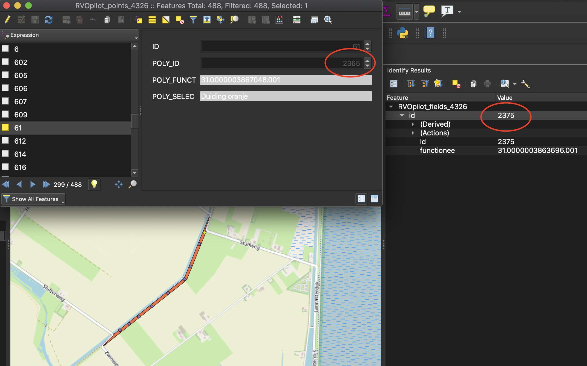

*Time to complete: this tutorial is expected to take anywhere from 30 minutes to 2 hours depending on your QGIS and satellite imagery familiarity.*

## Visualize Planet Analytics insights for Port Activity monitoring using QGIS

In this tutorial, you will learn how to explore Planet Analytic Ship Detection _Feeds_, visualize _Collections_ over your AOI and derive insights from them using QGIS.

Make sure to revise our public [Analytic Jupyter Notebooks](https://github.com/planetlabs/notebooks/tree/master/jupyter-notebooks/analytics) for more knowledge on retrieving _Collections_ from different _Feeds_.


### **What will you need?**

We will be using Python 3+ to download _Collections_ using the Analytics API with a `Jupyter Notebook`. Therefore, make sure the `requests` and `notebook` packages are installed. 

[comment]: # (You will also need to make sure you have a _Subscription_ to Planet Analytic Vessel Detection Feeds, although a subscription for Airplane detection should work too. If you don't have one, feel free to contact sales -https://www.planet.com/contact-sales/#contact-sales-cta- to request a Trial access.)

### **But, what are Analytic Feeds?**

Planet Analytics leverages machine learning and computer vision techniques to extract critical objects and
features from Planet imagery, providing customers with deeper insights at a higher frequency than ever before. 

Currently, insights are delivered in the shape of raster layers for _Buildings_ and _Roads_ detection _Feeds_ while _Ships_ and _Airplanes_ detections are packaged as GeoJSON _FeatureCollection_ objects.

A final note before we start: You have probably noticed that the words _Feeds_, _Subscriptions_ and _Collections_ on this tutorial have been meticulously _emphasized_. That is because they are important concepts that we need to know to understand how Planet Analytics work. Let's define them:

* **Feeds**: an analytic derived from Planet imagery.
* **Subscription**: the access you will have to a Feed in terms of an Area of Interest (AOI) and Time
Interval of Interest (TOI).
* **Collections**: Analytic outputs from Planet’s computer vision models.

Learn more about Planet Analytics [here](https://assets.planet.com/docs/planet-analytics-datasheet-us-letter.pdf).

### **Let's Explore**
All the code found in the following lines is extracted from the Jupyter Notebook used during the training. You can go [there](02_fetching_feed_results.ipynb) to access the full download workflow.

**Let's start by retrieving all of our subscriptions**<br>
Using your Planet API key, make a call to the Analytics API to `GET` all of your subscriptions.

```python
import os
import requests

# Build URL for the Subscriptions endpoint
BASE_URL = "https://api.planet.com/analytics/"
subscriptions_list_url = BASE_URL + "subscriptions"

# construct auth tuple for use in the requests library
BASIC_AUTH = ("PASTE YOUR API KEY HERE", "")

# Make GET call
response = requests.get(subscriptions_list_url, auth=BASIC_AUTH)

# Parse JSON response into a variable
subscriptions = response.json()["data"]

# List all subscriptions by name and ID
for s in subscriptions:
    print("Subscription name: {}, ID: {}".format(s["title"], s["id"]))
```

Now, let's pick a _Subscription_ to pull results for and use it for our example. Copy the chosen _Subscription_ ID and paste it inline on the code below. 
```python
import json

subscription_ID = "PASTE YOUR SUBSCRIPTION ID HERE"

# Construct the url for the subscription's results collection
subscription_results_url = BASE_URL + 'collections/' + SUBSCRIPTION_ID + '/items'

# Get subscription results collection
resp = requests.get(subscription_results_url, auth=BASIC_AUTH)
```


### Let's download data created over the last three months

### Let's load the data onto QGIS

### Let's add date to data

### Let's filter data on score

### Let's use Plotly to see all detections and all 0.9 detections

### Let's save this




Here some template code:

        NDWI = (Green - near infrared) / (Green + near infrared)

In terms of the PlanetScope 4-band imagery, this formula can be expressed as:

        NDWI = (Band 2 - Band 4) / (Band 2 + Band 4)
