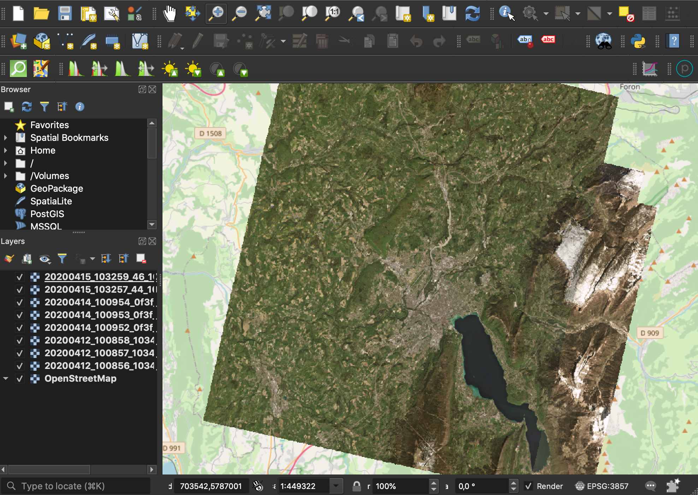
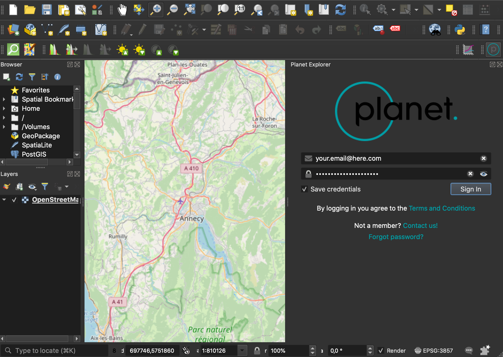
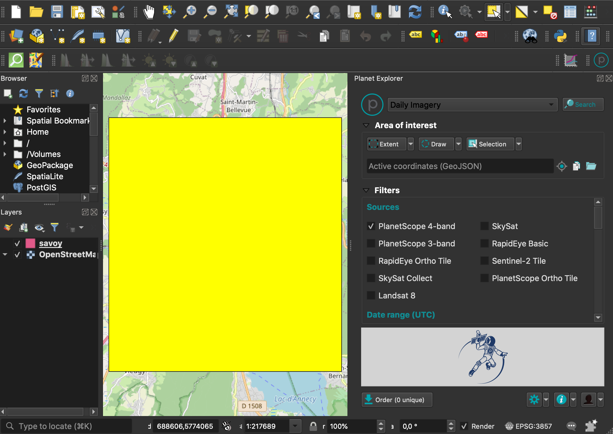
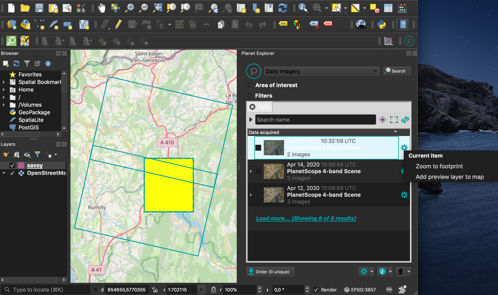
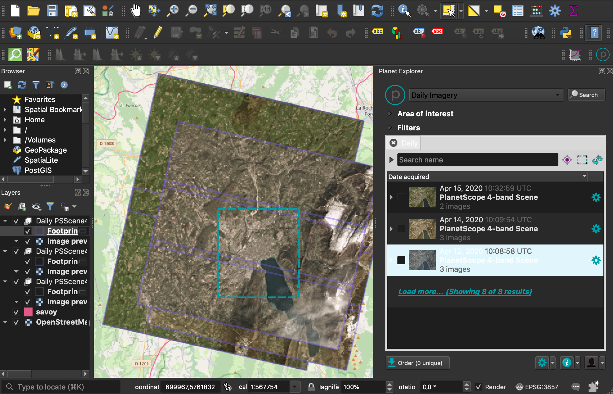

# How to Generate QuickLooks (QL) using Planet APIs
For this tutorial, we will cover a couple of options to generate downsampled/lower resolution imagery from PlanetScope scenes using Planet APIs.

You will neet to have the latest version of the `Planet` Command Line Interface (Planet CLI) and `jq`, a library to parse JSON type data on a terminal.

Before using the CLI, make sure you are authenticated to access Planet APIs. You can do that either by setting an env variable named `PL_API_KEY` or by doing
```bash
planet init
```
where you will have to enter you Planet credentials (Email and Password).

## 1. Orders API
Using the Orders API, you can use the `Reproject` raster tool to downsample any specific image you want to order. 

- Fastest approach, send order and wait for delivery.
- Processing done and costs covered by Planet.
- Final resolution is defined when creating the order.
- Downloaded images will be fully charged against organization quota.
- Delivered images are downsampled to required resolution.

#### Step-by-step

a. <a name="scenelist"></a>**Define your scene ID list**. Using Planet CLI, let's do a search over an AOI for `PSScene3Band` scenes for the last 4 days. First, let's see how many scenes we get.
```bash
planet data search --geom savoy.geojson --item-type PSScene3Band --date acquired gte 2020-04-12 | jq '.features | length'
```

Now, let's print all the scenes' IDs, concatenate them into a comma-separated string and copy that

```bash
planet data search --geom savoy.geojson --item-type PSScene3Band --date acquired gte 2020-04-12 | jq -r '.features | map(.id) | join(",")'
```

b. **Submit order**. let's make an order using the `Reproject` raster tool. When using the Planet CLI, the tool or tools chain need to be input as a `JSON` file. Let's create one containing the following JSON object. We can here define the resolution for our QL to be 60 m.

```json
[
    {
        "reproject": {
            "projection": "EPSG:3857",
            "kernel": "cubic",
            "resolution": "60.0"
        }
    }
]
```

Let's use the Planet CLI again to submit an order to the Orders API. For inpud IDs we use the `PSScene3Band` IDs copied on our previous step. We need to define the `bundle` or asset type we want to download, our order `name` and pass the name of our `tools` JSON file.

```bash
planet orders create --item-type PSScene3Band --bundle visual --id 20200415_103259_46_105e,20200415_103257_44_105e,20200414_100952_0f3f,20200414_100954_0f3f,20200414_100953_0f3f,20200412_100858_1034,20200412_100856_1034,20200412_100857_1034 --name esa-demo-ql-reproject-1 --tools reproject.json | jq .
```

c. **Check order status**. From the previous step's output, let's copy the `order-id`. Normally, we should wait a couple of minutes until the order finished processing. We can always check the order status by sending the below request using our own `order-id`
```bash
planet orders get cd79dfb4-7139-4a33-a096-9848c5bc80a8 | jq '"Name: " + .name +  ". Status: " + .state'
```

d. **Download order**. Once an order's `status` has changed to `success`, we can go ahead and download it with the below command:
```bash
planet -v orders download cd79dfb4-7139-4a33-a096-9848c5bc80a8 --dest esa-demo-orders --quiet
```
Now, we can visualise our QL on QGIS or any other GIS software.



## 2. Planet CLI + QGIS

We can also make use of the Planet integration with QGIS to easily and quickly obtain image footprints and stream pixels without consuming organization quota. The plugin can be found on QGIS's market place from version 3.6 on.

- Easy and quick solution for streaming imagery
- Planet Explorer UX mapped to QGIS
- Images are being streamed and not downloaded, hence, quota is not consumed.
- Images cannot be saved on local unless downloaded (counts against quota.)

### Step-by-step

a.**Define your scene ID list**. Follow the same steps shown in [1.a.](#scenelist) for getting a list of scenes over an AOI using the Planet CLI. Copy the list of IDs.

b.**Stream images on QGIS**. Open the Planet QGIS plugin and authenticate using your email and password.



Load your GeoJSON to QGIS and select the geometry using the _Feature Selection_ tool.



On the Planet Explorer tab, click on `Selection` and then on `Single Feature` to select your layer as your search AOI. Scroll down and paste the list of IDs from the previous step on the `Item IDs (comma separated)` input field. Hit `Search`.


A list of results will appear on the bottom part of the tab. If you hover on the results, you will get footprints displayed in your Map extent. You can also click on `Settings` for more options.



Clicking on `Add preview layer to map` will stream the full resolution images on your current Map.



<br><br>

## 3. Other options

### Tiles API + GDAL
You could also use external libraries for resampling Planet images before downloading them.
For instance, you could make use of Planet's Tiles services and `GDAL.translate` to modify the pixel size of the images on the go.

### Data API (non-georeference image)
On the `Data API` an end-point exists to retrieve an image _Thumbnail_ for each scene in Planet's catalog. These Thumbnails are not georeferenced images but can be very useful for web applications, online catalog skimming, etc.